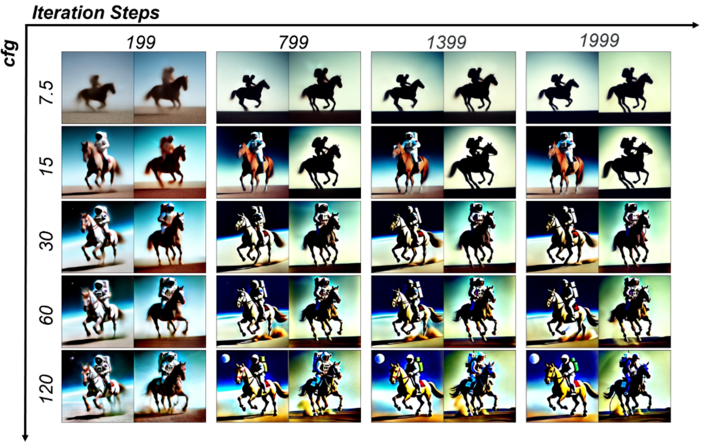

# 2D SDS Experimentation Framework

(A better name TBD.)

## Overview

This framework is designed for experimenting with **Score Distillation Sampling (SDS)** and its variations on 2D
representations.

If you are not familiar with SDS, please refer to [this paper](https://arxiv.org/abs/2209.14988).

## Why Choose This?

SDS and similar optimization-based methods are typically implemented in 3D generation frameworks
like [Threestudio](https://github.com/threestudio-project/threestudio). However, conducting experiments in 3D can be:

- **Time-consuming**
- **Complex**, as results may be affected by factors like 3D representations or camera configurations.

Sometimes, the goal is simply to identify the best optimization-based diffusion sampling strategy without being tied to
specific tasks, such as 3D, SVG, or 4D content generation.

This framework addresses that by implementing optimization-based methods on **2D representations** (e.g., pixels,
latents).

It provides a **simpler, more flexible**, and **user-friendly** way to experiment with various settings and techniques.

## Example

Here is an example of testing the SDS algorithm with different guidance scales.

## How to use it?

For installation, refer to [INSTALL.md](./docs/INSTALL.md).

For basic usage, refer to [USAGE.md](./docs/USAGE.md).

If you are interested in developing new algorithms, refer to [DEVELOPMENT.md](./docs/DEVELOPMENT.md).

## Implemented Features

### Algorithms

- Score Distillation Sampling (SDS)
- Variational Score Distillation (VSD)
- Interval Score Matching (ISM)
- Delta Denoising Score (DDS)

### 2D representations:

- pixel
- latents
- gaussians 2D

### Weight and timestep schedule:

- dreamfusion
- dreamtime
- hifa
- linear
- random decay
- etc.

## Acknowledgement

Some code is referred from [Threestudio](https://github.com/threestudio-project/threestudio). Many thanks to their great
work!